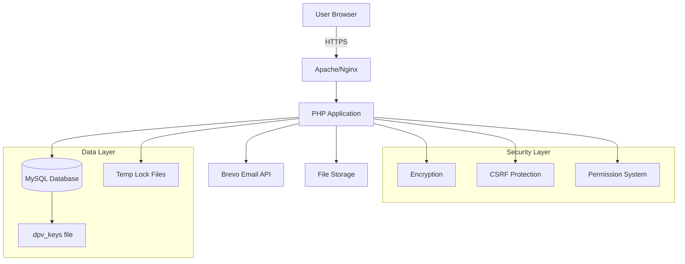
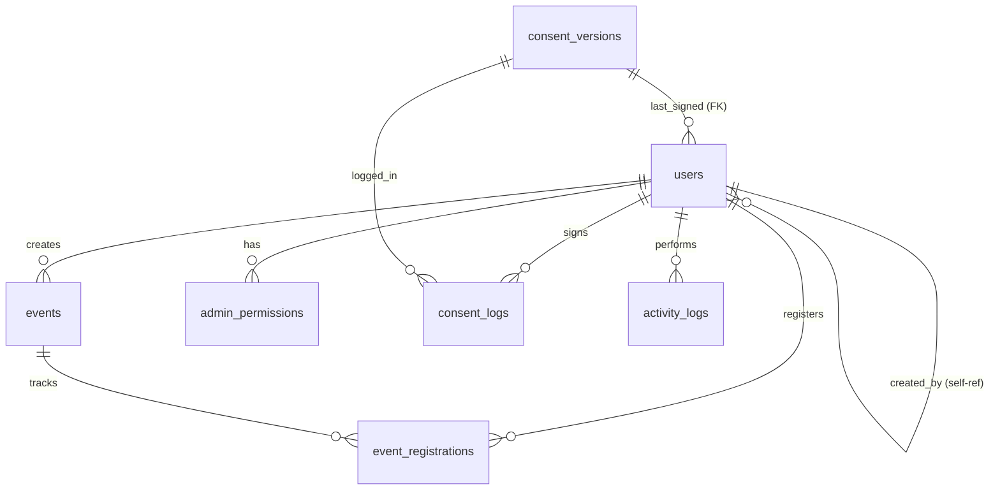

# 🏗️ DPV hub - Project Blueprint

> **Comprehensive Technical Documentation**  
> Last Updated: December 18, 2025

---

## 📋 Table of Contents
1. [Project Overview](#project-overview)
2. [System Architecture](#system-architecture)
3. [Database Schema](#database-schema)
4. [Directory Structure](#directory-structure)
5. [Core Modules](#core-modules)
6. [Security Implementation](#security-implementation)
7. [Deployment Guide](#deployment-guide)

---

## 🎯 Project Overview

**DPV hub** is a volunteer management system for Dubai Police with multilingual support (English, Arabic, Urdu) featuring:
- 🔐 Encrypted user data storage (AES-256-GCM)
- 📱 QR code-based attendance tracking
- 🎟️ Event management with offline sync capability
- 📊 Advanced reporting and analytics
- ✅ GDPR-compliant consent management

### Technology Stack
- **Backend:** PHP 8.4+ (Pure PHP, no frameworks)
- **Database:** MySQL 8.0+ (utf8mb4)
- **Frontend:** Vanilla JavaScript, TailwindCSS concepts
- **Email:** Brevo API (transactional emails)
- **Security:** Sodium-based encryption, CSRF protection, blind indexing

---

## 🏛️ System Architecture

### High-Level Architecture



### Request Flow

```
HTTP Request → .htaccess → init.php →Auth/Permission Check → Controller → Database → Response
                    ↓
              Security Headers (CSP, X-Frame-Options)
```

### User Roles & Permissions

| Role | Capabilities |
|------|-------------|
| **Super Admin** | Full system access, user creation, settings management |
| **Admin** | Can create users, manage events (limited to own creations) |
| **User** | View own profile, register for events, digital card access |

---

## 💾 Database Schema

### Tables Overview (9 Core Tables)

#### 1. **users** - Core User Data
```sql
CREATE TABLE users (
  id INT PRIMARY KEY AUTO_INCREMENT,
  dp_code VARCHAR(20) UNIQUE NOT NULL,              -- DP-XXXXX
  v_number VARCHAR(16) UNIQUE,                      -- V-XXXXX
  full_name VARCHAR(512) NOT NULL,                  -- Encrypted
  full_name_ar VARCHAR(512) NOT NULL,               -- Encrypted
  email VARCHAR(512) NOT NULL,                      -- Encrypted
  email_hash VARCHAR(64) UNIQUE,                    -- Blind index
  mobile VARCHAR(256) NOT NULL,                     -- Encrypted
  mobile_hash VARCHAR(64) UNIQUE,                   -- Blind index
  emirates_id VARCHAR(256) NOT NULL,                -- Encrypted
  emirates_id_hash VARCHAR(64) UNIQUE,              -- Blind index
  password_hash VARCHAR(255) NOT NULL,
  role ENUM('user','admin','super_admin') DEFAULT 'user',
  created_by INT,                                    -- FK to users.id
  last_consent_version_id INT,                      -- FK to consent_versions.id
  -- ... + 10 more fields (see dpvhub_db.sql)
  INDEXES: dp_code, email_hash, mobile_hash, emirates_id_hash, role, created_by
);
```

**Encryption Strategy:**
- **Encrypted:** `full_name`, `email`, `mobile`, `emirates_id` (AES-256-GCM)
- **Blind Indexed:** `email_hash`, `mobile_hash`, `emirates_id_hash` (for UNIQUE constraints)

#### 2. **events** - Event Management
```sql
CREATE TABLE events (
  id INT PRIMARY KEY AUTO_INCREMENT,
  name VARCHAR(200) NOT NULL,
  description TEXT,
  start_datetime DATETIME NOT NULL,
  location VARCHAR(255) NOT NULL,
  public_slug VARCHAR(120) UNIQUE,                  -- For public registration
  console_slug VARCHAR(120) UNIQUE,                 -- For admin console
  console_password_hash VARCHAR(255),               -- Separate from user auth
  banner_image VARCHAR(255),
  capacity INT DEFAULT 0,                           -- 0 = unlimited
  created_by INT NOT NULL,                          -- FK to users.id
  INDEXES: public_slug, console_slug, start_datetime
);
```

#### 3. **event_registrations** - Attendance Tracking
```sql
CREATE TABLE event_registrations (
  id INT PRIMARY KEY AUTO_INCREMENT,
  event_id INT NOT NULL,                            -- FK to events.id
  user_id INT NOT NULL,                             -- FK to users.id
  ref_number VARCHAR(80),                           -- Reference/Badge number
  has_reference TINYINT(1) DEFAULT 0,
  status ENUM('registered','checked_in','checked_out','absent','cancelled'),
  checkin_time DATETIME,
  checkout_time DATETIME,
  vest_number VARCHAR(20),                          -- Equipment tracking
  vest_returned TINYINT(1) DEFAULT 0,
  UNIQUE KEY: (event_id, user_id)                   -- One registration per user/event
);
```

#### 4. **dp_pool** - DP Code Pre-allocation
```sql
CREATE TABLE dp_pool (
  dp_code VARCHAR(8) PRIMARY KEY,                   -- e.g., "DP-00001"
  is_used TINYINT(1) DEFAULT 0
);
```
Pre-generated pool of 99,999 codes for sequential assignment.

#### 5. **consent_versions** - GDPR Compliance
```sql
CREATE TABLE consent_versions (
  id INT PRIMARY KEY AUTO_INCREMENT,
  content_en TEXT NOT NULL,
  content_ar TEXT NOT NULL,
  content_ur TEXT NOT NULL,
  published_at TIMESTAMP DEFAULT CURRENT_TIMESTAMP,
  published_by INT,                                 -- FK to users.id (super_admin)
  INDEXES: published_at
);
```

#### 6. **consent_logs** - Audit Trail
```sql
CREATE TABLE consent_logs (
  id INT PRIMARY KEY AUTO_INCREMENT,
  user_id INT NOT NULL,                             -- FK to users.id
  consent_version_id INT NOT NULL,                  -- FK to consent_versions.id
  signed_at TIMESTAMP DEFAULT CURRENT_TIMESTAMP,
  ip_address VARCHAR(45),
  signed_language ENUM('en','ar','ur'),
  input_snapshot VARCHAR(255),                      -- Typed name for signature
  INDEXES: user_id, consent_version_id
);
```

#### 7. **activity_logs** - System Audit
```sql
CREATE TABLE activity_logs (
  id INT PRIMARY KEY AUTO_INCREMENT,
  actor_user_id INT,                                -- FK to users.id
  action VARCHAR(120) NOT NULL,                     -- e.g., 'create_user', 'event_checkin'
  entity_type VARCHAR(80),                          -- e.g., 'user', 'event'
  entity_id INT,
  meta JSON,                                        -- Additional context
  ip_address VARCHAR(45),
  user_agent VARCHAR(255),
  created_at TIMESTAMP DEFAULT CURRENT_TIMESTAMP,
  INDEXES: action, actor_user_id, created_at
);
```

#### 8. **admin_permissions** - Granular Access Control
```sql
CREATE TABLE admin_permissions (
  id INT PRIMARY KEY AUTO_INCREMENT,
  user_id INT NOT NULL,                             -- FK to users.id
  permission_key VARCHAR(80) NOT NULL,              -- e.g., 'manage_users', 'manage_events'
  allowed TINYINT(1) DEFAULT 1,
  UNIQUE KEY: (user_id, permission_key)
);
```

#### 9. **app_settings** - Key-Value Config Store
```sql
CREATE TABLE app_settings (
  `key` VARCHAR(120) PRIMARY KEY,
  value TEXT
);
```
Example: `general_role_title` → \"Volunteer\"

### Database Relationships



---

## 📁 Directory Structure

```
d:/gpt-agent/dpvhub/ghraviti-dpv/
│
├── 📄 index.php                    # Landing page (login/register)
├── 📄 config.php                   # Core configuration (DB, BASE_URL, upload dirs)
├── 📄 db.php                       # Database connection wrapper
├── 📄 functions.php                # Layout helpers (header/footer/nav)
├── 📄 mail_service.php             # Email service (Brevo API)
├── 📄 image.php                    # Authenticated image server
├── 📄 consent.php                  # Consent gating page
├── 📄 dpvhub_db.sql                # Database schema dump
├── 📄 .htaccess                    # Apache config (rewrites, security headers)
│
├── 📂 includes/                    # Core PHP libraries
│   ├── init.php                    # Bootstrap file (loads all helpers)
│   ├── encryption.php              # AES-256-GCM encryption + blind indexing
│   ├── helpers_auth.php            # Authentication & permissions
│   ├── helpers_user.php            # User CRUD operations
│   ├── helpers_qr.php              # QR code generation (DP codes)
│   ├── helpers_upload.php          # File upload handlers (avatars, IDs, banners)
│   ├── helpers_consent.php         # Consent version management
│   ├── helpers_activity.php        # Activity logging
│   ├── helpers_date.php            # Dubai timezone handling
│   ├── helpers_validation.php      # UAE-specific validation (mobile, EID)
│   ├── helpers_core.php            # Utility functions (h(), csrf_token(), etc.)
│   └── settings.php                # App settings get/set
│
├── 📂 admin/                       # Admin Dashboard
│   ├── dashboard.php               # Admin home (stats, charts)
│   ├── users.php                   # User management (list, create)
│   ├── user_edit.php               # User profile editing
│   ├── user_uploads.php            # Photo upload page
│   ├── admins.php                  # Admin user management
│   ├── events.php                  # Event listing
│   ├── event_form.php              # Event create/edit
│   ├── attendees.php               # Event attendee management
│   ├── export.php                  # CSV export (streaming)
│   ├── custom_export.php           # Custom field selection export
│   ├── admin_reports.php           # Activity reports
│   ├── admin_report_export.php     # Activity report CSV
│   ├── consent_manager.php         # Consent version publishing
│   ├── logs.php                    # Activity logs viewer
│   └── settings_role.php           # General role title setting
│
├── 📂 user/                        # User Dashboard
│   ├── dashboard.php               # User home (events, profile)
│   └── card.php                    # Digital DP card (QR display)
│
├── 📂 event/                       # Public Event Pages
│   ├── register.php                # Public event registration
│   ├── console.php                 # Event admin console (check-in/out)
│   └── console_api.php             # API for offline sync (POST-based)
│
├── 📂 auth/                        # Authentication
│   ├── login.php                   # Login page
│   ├── logout.php                  # Session destroy
│   └── password.php                # Password reset
│
├── 📂 assets/                      # Static Files
│   ├── css/                        # Stylesheets
│   ├── js/                         # JavaScript (cropper, html5-qrcode)
│   ├── images/                     # Static images (logo, etc.)
│   └── uploads/                    # User-uploaded files
│       ├── avatars/                # Profile photos
│       ├── ids/                    # Emirates ID images
│       ├── qr/                     # Generated QR codes
│       ├── cards/                  # Generated ID cards
│       └── events/                 # Event banners
│
├── 📂 lib/                         # Third-party Libraries
│   └── (phpqrcode, etc.)
│
└── 📂 config/                      # Application Config
    └── app.php                     # Redirect rules

```

---

## ⚙️ Core Modules

### 1. Authentication System
**Files:** `includes/helpers_auth.php`, `auth/*`

**Features:**
- Session-based authentication
- Password hashing (PHP `password_hash()`)
- CSRF protection on all forms
- Role-based access control (RBAC)
- Permission system for admins

**Key Functions:**
```php
require_login()                    // Ensure user logged in
require_role(['admin'])            // Require specific role
require_permission('manage_users') // Check granular permission
current_user()                     // Get logged-in user data
is_super_admin()                   // Check if super admin
```

### 2. Encryption System
**File:** `includes/encryption.php`

**Features:**
- **Algorithm:** AES-256-GCM (authenticated encryption)
- **Key Storage:** `.dpv_keys` file (outside web root)
- **Blind Indexing:** HMAC-SHA256 for searchable encrypted fields

**Key Functions:**
```php
encrypt_user_data($data)           // Encrypt before INSERT
decrypt_user_data($row)            // Decrypt after SELECT
blind_index($plaintext, $purpose)  // Create searchable hash
```

**Why Blind Indexing?**
- Can't use UNIQUE constraints on encrypted data
- Solution: Store `email_hash = HMAC(email)` alongside encrypted email
- Enables uniqueness checks without exposing plaintext

### 3. QR Code System
**File:** `includes/helpers_qr.php`

**Flow:**
1. User creation → Allocate DP code from `dp_pool`
2. Generate QR PNG: `generate_qr_png($dpCode, $path)`
3. Store path in `users.qr_path`
4. Display in digital card (`user/card.php`)

### 4. Event Management
**Files:** `admin/events.php`, `event/*`

**Offline Sync Mechanism:**
- Event console can work offline (PWA-like)
- Actions queued in localStorage
- On reconnect: POST to `console_api.php`
- **Idempotency:** Lock files prevent duplicate processing
  - File: `sys_get_temp_dir() . '/dpv_idem_' . sha1($uuid) . '.lock'`
  - Auto-cleanup: GC runs with 1% probability, deletes >24h files

**Race Condition Prevention (CRITICAL):**
- Uses `flock(LOCK_EX | LOCK_NB)` for exclusive locking
- Lock per user+event: `dpv_lock_{hash(slug_userId)}.lock`
- Returns HTTP 429 if lock unavailable (client retries)
- Re-fetches registration status INSIDE lock block

### 5. Consent Management
**Files:** `includes/helpers_consent.php`, `consent.php`, `admin/consent_manager.php`

**GDPR Compliance:**
- Multi-version support (can publish new versions)
- Tri-lingual content (EN/AR/UR)
- Audit trail in `consent_logs` (who, when, IP, which version)
- Users must re-accept when new version published

### 6. CSV Export (Streaming)
**File:** `admin/export.php`

**Optimization:**
```php
// OLD (Memory Exhaustion):
$rows = fetch_users_decrypted("SELECT ...");  // Loads all in RAM
foreach ($rows as $row) { fputcsv($out, $row); }

// NEW (Streaming):
$stmt = db()->prepare("SELECT ...");
$stmt->execute([...]);
while ($row = $stmt->fetch(PDO::FETCH_ASSOC)) {
    $row = decrypt_user_data($row);  // Decrypt 1 row
    fputcsv($out, $ordered);         // Write immediately
}
```
✅ Supports 10M+ rows without RAM issues

---

## 🔒 Security Implementation

### 1. Data Protection
| Layer | Implementation |
|-------|---------------|
| **Encryption at Rest** | AES-256-GCM for PII (email, mobile, EID) |
| **Blind Indexing** | HMAC-SHA256 for searchable encrypted fields |
| **Password Security** | `PASSWORD_DEFAULT` (bcrypt) with cost 10 |
| **Key Management** | `.dpv_keys` file outside web root |

### 2. Input Validation
```php
validate_email($email)                // RFC 5322 + DNS check
validate_mobile_uae($mobile)          // UAE format: 05XXXXXXXX
validate_emirates_id($eid)            // XXX-XXXX-XXXXXXX-X
```

### 3. Upload Security
**File:** `includes/helpers_upload.php`

- **Validation:** MIME type + extension + file signature check
- **Size Limits:** Avatar (500KB), EID (1500KB), Banner (2000KB)
- **Storage:** Outside web root with `.htaccess` protection
- **Serving:** Via `image.php` with authentication

### 4. CSRF Protection
```php
// Generate token
csrf_token()

// Validate
csrf_check($_POST['csrf'])
```
All POST forms include hidden CSRF token.

### 5. Security Headers (`init.php`)
```php
header('X-Frame-Options: DENY');
header('X-Content-Type-Options: nosniff');
header('X-XSS-Protection: 1; mode=block');
header('Referrer-Policy: strict-origin-when-cross-origin');
header("Content-Security-Policy: frame-ancestors 'none'");
header('Strict-Transport-Security: max-age=31536000; includeSubDomains; preload');
```

### 6. Open Redirect Protection
**File:** `includes/helpers_core.php`

```php
function sanitize_redirect_path(?string $value): string
{
    // CRITICAL: Block protocol-relative URLs (//example.com)
    if (str_starts_with($value, '//') || !str_starts_with($value, '/')) {
        return '/user/dashboard.php';
    }
    // Extract only path component
    return parse_url($value, PHP_URL_PATH) ?? '/user/dashboard.php';
}
```

### 7. Race Condition Prevention (`console_api.php`)
```php
$lockFile = sys_get_temp_dir() . '/dpv_lock_' . md5($slug . '_' . $user['id']) . '.lock';
$fp = fopen($lockFile, 'c+');

if (!flock($fp, LOCK_EX | LOCK_NB)) {
    json_response(429, ['error' => 'REQUEST_IN_PROGRESS']);
}

try {
    // Re-fetch registration INSIDE lock
    $reg = fetch_one('SELECT * FROM event_registrations WHERE ...');
    // ... execute queries ...
} finally {
    flock($fp, LOCK_UN);
    fclose($fp);
}
```

---

##  Deployment Guide

### Prerequisites
- **PHP:** 8.4+ with extensions: `pdo_mysql`, `gd`, `sodium`, `mbstring`, `curl`
- **MySQL:** 8.0+
- **Web Server:** Apache 2.4+ or Nginx
- **SSL Certificate:** Required for production

### Installation Steps

#### 1. Database Setup
```bash
mysql -u root -p < dpvhub_db.sql
```

#### 2. Credential Configuration
Create `.dpv_keys` file in `/home/dpvhub/` (or 2 levels above web root):
```ini
DB_PASS=your_db_password
BREVO_API_KEY=xkeysib-...
```

Generate encryption keys:
```bash
php -r "echo bin2hex(random_bytes(32)) . PHP_EOL;"  # ENCRYPTION_KEY
php -r "echo bin2hex(random_bytes(32)) . PHP_EOL;"  # BLIND_INDEX_KEY
```

Add to `.dpv_keys`:
```ini
ENCRYPTION_KEY=64_hex_chars
BLIND_INDEX_KEY=64_hex_chars
```

#### 3. File Permissions
```bash
chmod 600 .dpv_keys
chmod 755 assets/uploads/
chmod 755 assets/uploads/{avatars,ids,qr,cards,events}
```

#### 4. Pre-populate DP Pool (Optional)
```bash
php cli/generate_dp_pool.php
```

#### 5. Create Super Admin
```sql
INSERT INTO users (dp_code, full_name, email, password_hash, role) 
VALUES ('DP-00001', 'Admin Name', 'admin@example.com', '$2y$10$...', 'super_admin');
```

#### 6. Apache Configuration
```apache
<VirtualHost *:443>
    ServerName dpvhub.example.com
    DocumentRoot /var/www/dpvhub
    
    SSLEngine on
    SSLCertificateFile /path/to/cert.pem
    SSLCertificateKeyFile /path/to/key.pem
    
    <Directory /var/www/dpvhub>
        AllowOverride All
        Require all granted
    </Directory>
</VirtualHost>
```

### Environment Variables (Optional)
```bash
export BASE_URL="/dpvhub"
export DB_PASS="..."
export BREVO_API_KEY="..."
```

---

## 📊 Performance Optimizations

### Implemented
- ✅ N+1 query elimination (pre-fetching)
- ✅ Streaming CSV export
- ✅ Lock file garbage collection
- ✅ Chunked image serving (8KB chunks)
- ✅ CLI-safe config (no `$_SERVER` crashes)

### Database Indexes
```sql
-- Critical indexes for performance
users: email_hash, mobile_hash, emirates_id_hash, dp_code, role, created_by
events: public_slug, console_slug, start_datetime
event_registrations: (event_id, user_id) UNIQUE
activity_logs: action, created_at
```

---

## 🧪 Testing Checklist

### Functional Tests
- [ ] User registration flow
- [ ] Event creation → public registration → check-in → check-out
- [ ] CSV export with 10k+ users
- [ ] Offline event console sync
- [ ] Consent version update flow
- [ ] Photo upload (avatar + EID)

### Security Tests
- [ ] CSRF token validation
- [ ] Role escalation attempts (regular admin → super admin)
- [ ] IDOR testing (modify other user's data)
- [ ] SQL injection attempts
- [ ] File upload bypass attempts

### Performance Tests
- [ ] Export 50k users (should not timeout)
- [ ] 100 concurrent event check-ins
- [ ] Lock file GC running correctly

---

## 📝 Notes

### Known Limitations
- Single database server (no read replicas)
- No Redis/Memcached caching layer
- Email limited to Brevo API (no fallback SMTP)

### Future Enhancements
- API layer for mobile apps
- Real-time event dashboard (WebSockets)
- Advanced analytics (Power BI integration)
- Multi-tenant support

---

## 📞 Support

For technical questions or issues, refer to:
- Database Schema: `dpvhub_db.sql`
- Architecture Audit: `CODE_ARCHITECTURE_AUDIT_REPORT.md`
- Code Documentation: Inline PHPDoc comments

---

**Document Version:** 1.1  
**Last Updated:** December 18, 2025  
**Critical Hotfixes Applied:** Race Condition, Open Redirect, HSTS
